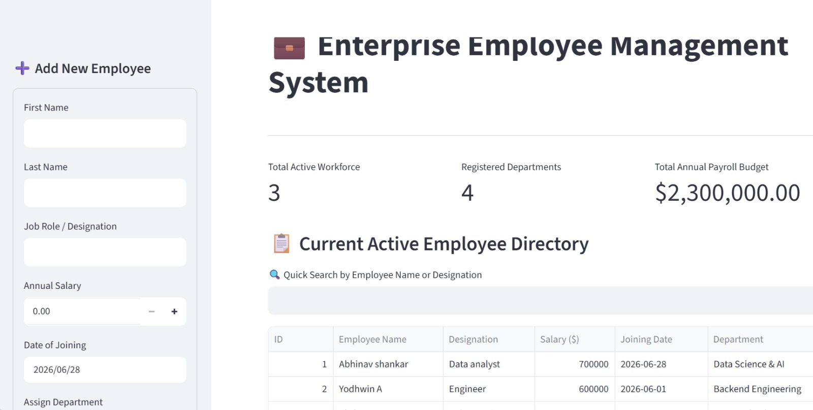
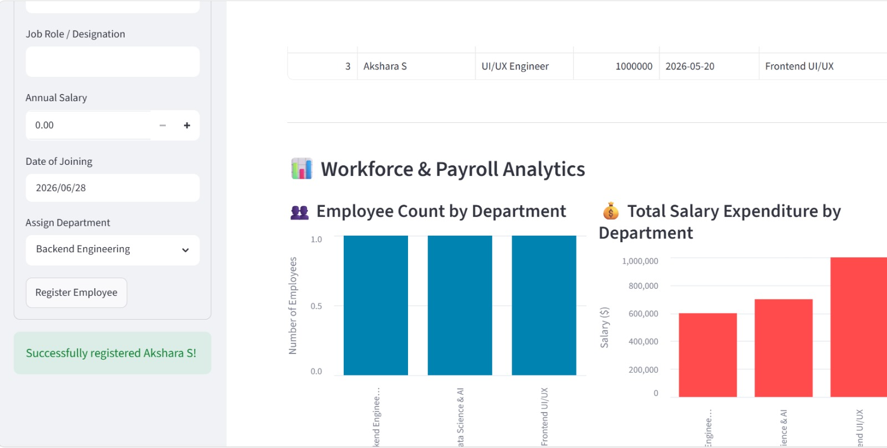

# 🚀 Full-Stack Engineering Portfolios

A collection of professional full-stack web applications built with **Python**, **Streamlit**, and **SQLite**.

---

## 1. 💼 Enterprise Employee Management System (EMS)
A relational business intelligence application designed to track company workforce structures, management links, and live payroll metrics.

### 📸 Application Preview

### 🛠️ EMS Features & Tech Stack
* **Relational DB Design**: Implements linked tables (`employees` ➡️ `departments`) via SQL Foreign Keys.
* **Live Financial Analytics**: Real-time KPI summaries capturing active headcount and total annual payroll budget.
* **Dynamic Business Intelligence**: Interactive bar charts powered by **Pandas** mapping workforce distribution and salary expenditures.
* **Tech Stack**: Python 3, Streamlit, SQLite3, Pandas, Git.

---

## 2. 📋 Enterprise Project Task Tracker
A clean CRUD application built to manage, filter, and track technical engineering project deadlines.

### 🛠️ Task Tracker Features
* **Full CRUD Operations**: Create, Read, Update, and Delete project assignments seamlessly.
* **Advanced Data Filters**: Real-time query search boxes alongside dynamic operational category dropdowns.
* **Tech Stack**: Python 3, Streamlit, SQLite3.
